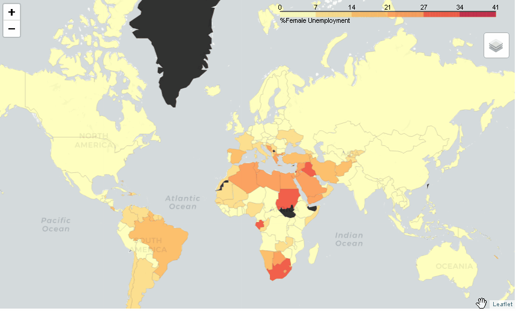
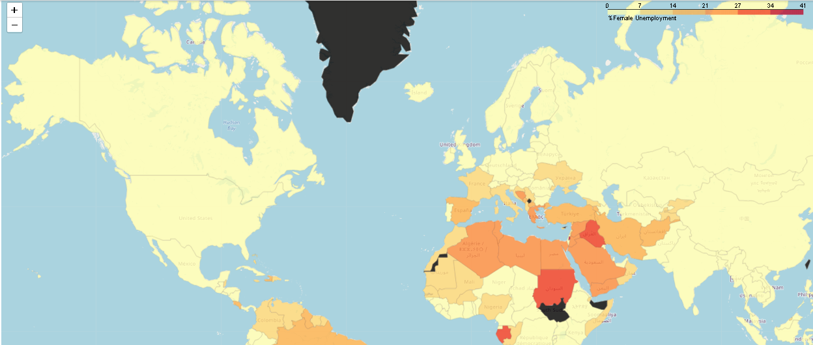

#### Coursera Project to calculate basic statistics of a World Bank Dataset
#### The indicator selected to do all the stats calculation is % Unemployment for Females (WorldWide) Year 2019
#### Finally, the indicator data is displayed using folium choropleth (only data for Year 2019)
Table of Contents

<a href="worldss.html" class="button">Continue Reading</a>

<ul>
  
  
   
<li>Folium map to display Indicator % Female Unemployment WorldWide with different tiles</li>

<li>Download data, upload data, read data into pandas</li>
<li>Cleaning the data by sorting and merging 2 data sets and dropping unnecessary columns</li>
<li>Selecting 1 indicator </li>
<li>Merging 2 data sets: % Unemployment and income group by country </li>
<li> Removing all the NAN values and countries without values </li>
<li> Calculating main stats of the data set (mean, std, quartiles) </li>
<li> Transpose the data year column, income groups as index </li>
<li> Display mean % Female Unemployment by Income Group and Year </li>

<li> Display mean % Female Unemployment by Region and Year </li>
<li> ANOVA Calculation of Income Group Data and boxplot display</li>  
<li> Selecting 2019 data </li>  
<li> the indicator data for selected year is displayed using folium choropleth </li>

</ul>

